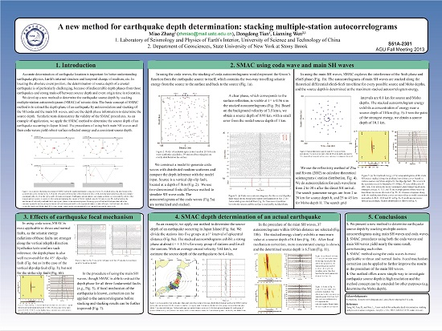
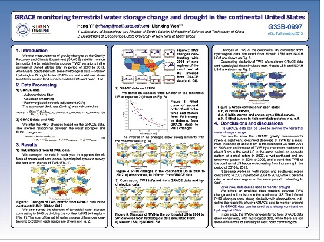
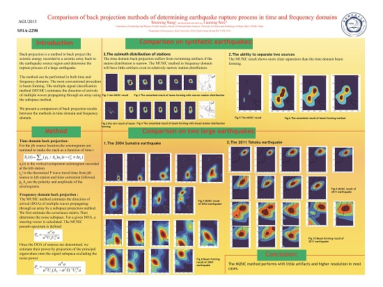
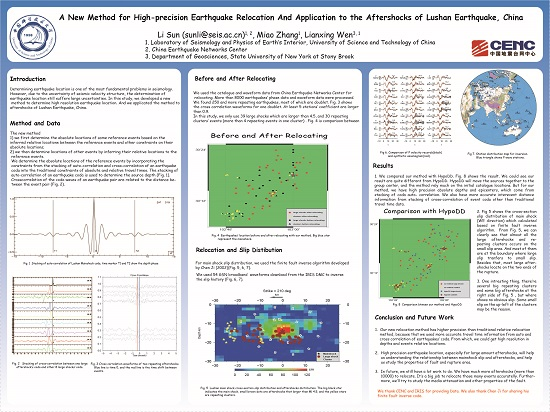
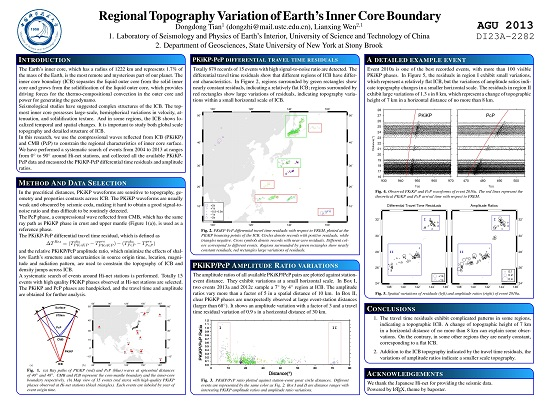
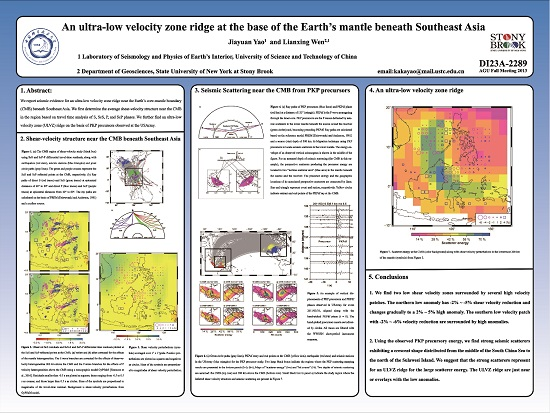
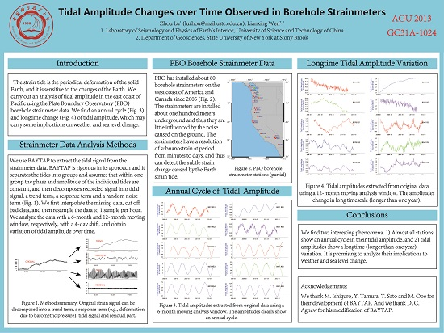

高分辨率海报请在附件下载

A new method for earthquake depth determination: stacking multiple-station autocorrelograms
ABSTRACT NUMBER: S51A-2301

GRACE monitoring terrestrial water storage change and drought in the continental United States
ABSTRACT NUMBER: G33B-0997

Comparison of back projection methods of determining earthquake rupture process in time and frequency domains
ABSTRACT NUMBER: S51A-2298

A New Method for High-precision Earthquake Relocation And Application to the Aftershocks of Lushan Earthquake, China

Regional Topography Variation of Earth's Inner Core Boundary
ABSTRACT NUMBER: DI23A-2282

An ultra-low velocity zone ridge at the base of the Earth's mantle beneath Southeast Asia
ABSTRACT NUMBER: DI23A-2289

Seismic Tracking of Hurricane Sandy
ABSTRACT NUMBER: S11A-2296

Tidal Amplitude Changes over Time Observed in Borehole Strainmeters
ABSTRACT NUMBER: GC31A-1024

[陈箫翰](chenxh.png)  [陆洲](luz.png)  [田冬冬](tiandd.png) [姚家园](yaojy.png) [张淼](zhangm.png) [易航](yih.png) [王文明](wangwm.png)
