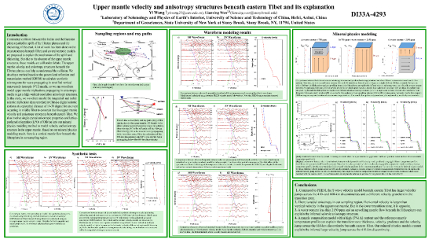
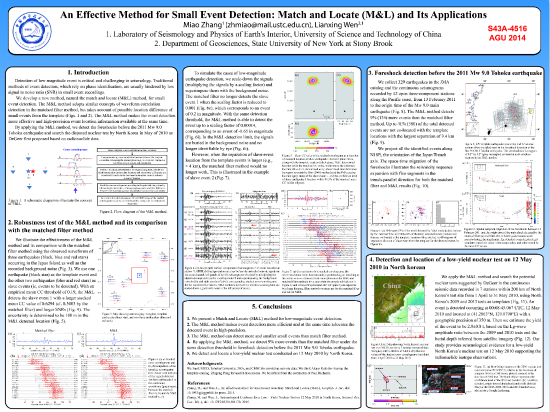
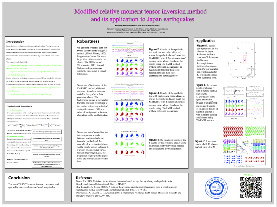
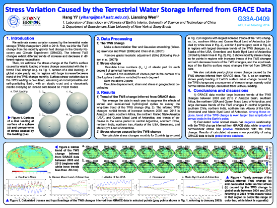
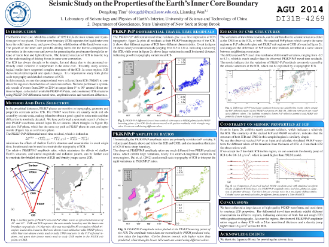
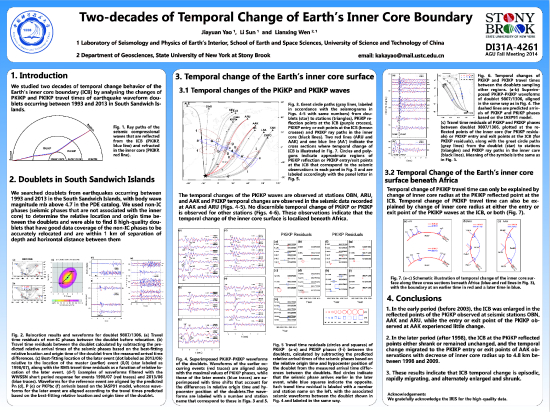
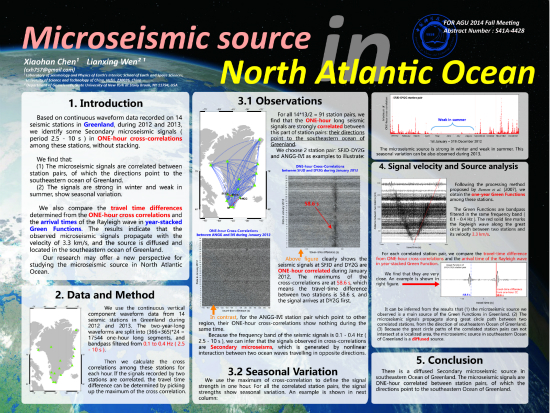
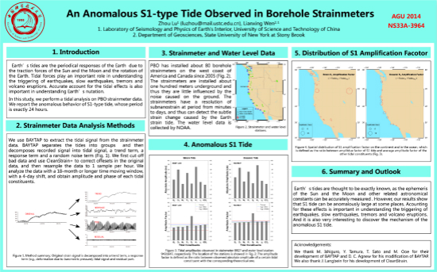

高分辨率海报请在附件下载

**Yi Wang** and Lianxing Wen, Upper mantle velocity and anisotropy structures beneath eastern Tibet and its explanation, **DI33A-4293**

**Miao Zhang** and Lianxing Wen, An Effective Method for Small Event Detection: Match and Locate (M&L) and Its Applications, **S43A-4516**

**Wenming Wang** and Lianxing Wen, Modified relative moment tensor inversion method and its application to Japan earthquakes, **S33B-4527**

**Hang Yi** and Lianxing Wen, Stress Variation Caused by the Terrestrial Water Storage Inferred from GRACE Data, **G33A-0409**

Dongdong Tian and Lianxing Wen, Seismic Study on the Properties of the Earth's Inner Core Boundary, DI31B-4269

Jiayuan Yao, Li Sun and Lianxing Wen, Two-decades of Temporal Change of Earth’s Inner Core Boundary, DI31A-4261

Xiaohan Chen and Lianxing Wen, Microseismic source in North Atlantic Ocean, S41A-4428

Zhou Lu and Lianxing Wen, An anomalous S1-type tide observed in borehole strainmeters, NS33A-3964

[陈箫翰](chenxh.png)  [陆洲](luz.png)  [田冬冬](tiandd.png) [姚家园](yaojy.png) [张淼](zhangm.png) [易航](yih.png) [王毅](wangy.png) [王文明](wangwm.png)
