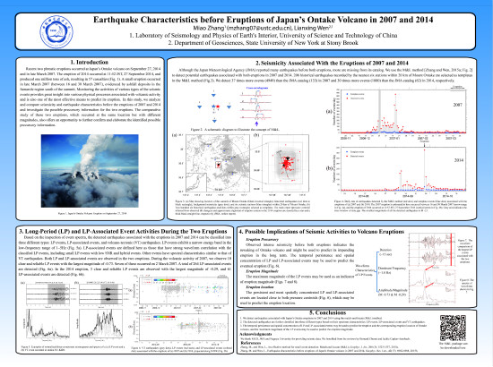
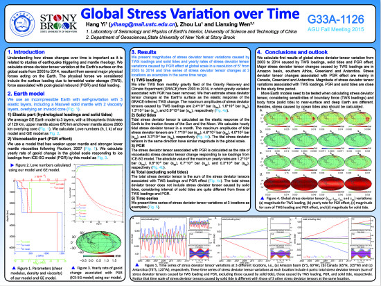
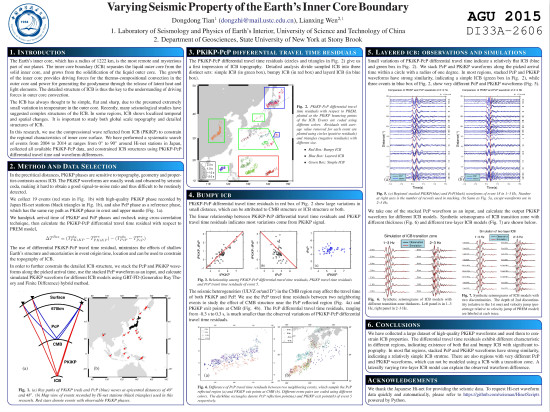
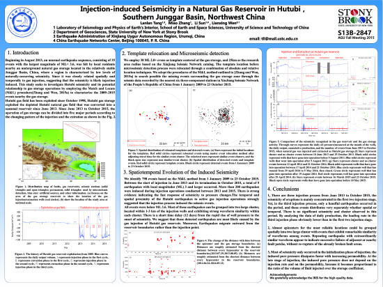
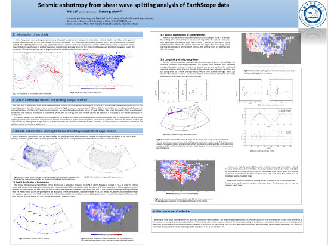
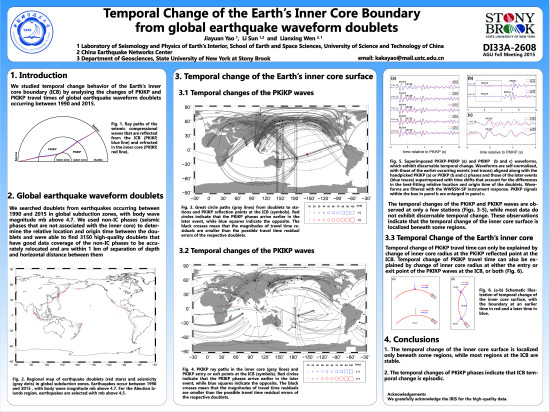
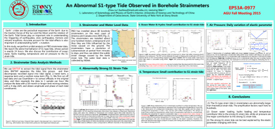
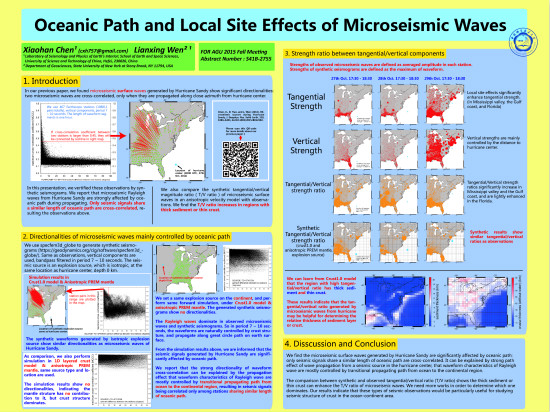

高分辨率海报请在附件下载

**Miao Zhang** and Lianxing Wen, Earthquake characteristics before eruptions of Japan's Ontake volcano in 2007 and 2014, **S51D-2745**

**Hang Yi**, Zhou Lu and Liangxing Wen, Global Stress Variation over Time, **G33A-1126**

Dongdong Tian and Lianxing Wen, Varying Seismic Property of the Earth's Inner Core Boundary. DI33A-2606

Lanlan Tang, Miao Zhang, Li Sun, Lianxing Wen. Injection-induced Seismicity in a Natural Gas Reservoir in Hutubi，Southern Junggar Basin, Northwest China. S13B-2847.

Wei Lei and Lianxing Wen， Seismic anisotropy from shear wave splitting analysis of EarthScope data， DI21A-2589

Jiayuan Yao, Li Sun and Lianxing Wen, Temporal Change of the Earth's Inner Core Boundary from Global Earthquake Waveform Doublets, DI33A-2608

Shizhuo Mao, Xiaofeng Jia, Lianxing Wen, Joining Seismic Interferometry and a Migration Method to image Earth's Shallow Structure, S41B-2722

Zhou Lu and Lianxing Wen, An Abnormal S1-type Tide Observed in Borehole Strainmeters, EP53A-0977

Xiaohan Chen and Lianxing Wen,  Oceanic Path Effects of Microseismic Waves, S41B-2755

[陈箫翰](chenxh.jpg) [雷伟](leiw.jpg) [陆洲](luz.jpg) [毛仕卓](maosz.jpg) [唐兰兰](tangll.jpg) [田冬冬](tiandd.jpg) [姚家园](yaojy.jpg) [张淼](zhangm.jpg) [易航](yih.jpg)
