高分辨率海报请在附件下载

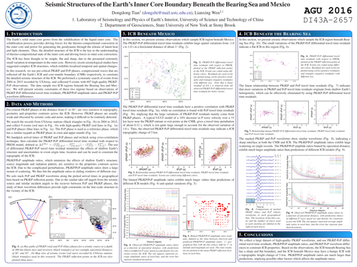

Seismic Structures of the Earth's Inner Core Boundary Beneath the Bearing Sea and Mexico

ABSTRACT NUMBER: DI43A−2657 (AGU 2016)

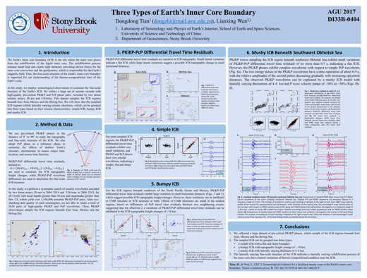

Three Types of Earth's Inner Core Boundary

ABSTRACT NUMBER: DI33B−0404 (AGU 2017)

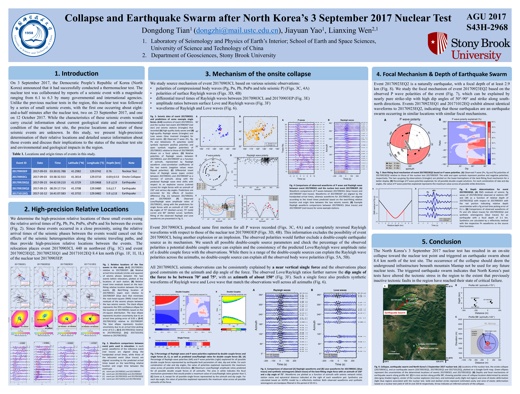

Collapse and Earthquake Swarm after North Korea's 3 September 2017 Nuclear Test

ABSTRACT NUMBER: S43H−2968 (AGU 2017)

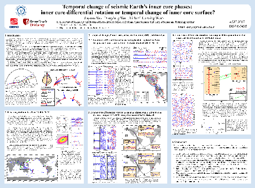

Temporal change of seismic Earth's inner core phases: inner core differential
rotation or temporal change of inner core surface

ABSTRACT NUMBER: DI33B−0405 (AGU 2017)

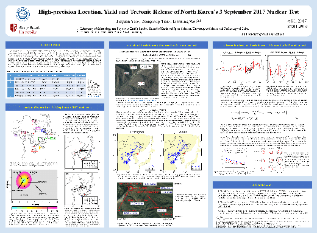

High-precision Location, Yield and Tectonic Release of North Korea's 3
		Sepetember 2017 Nuclear Test

ABSTRACT NUMBER: S43H−2967 (AGU 2017)

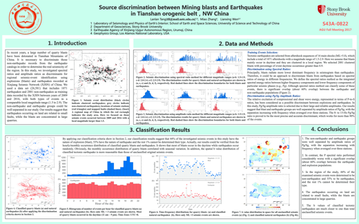
Source discrimination between Mining blasts and Earthquakes in Tianshan
		   orogenic belt, NW China

ABSTRACT NUMBER: S43A−0822 (AGU 2017)

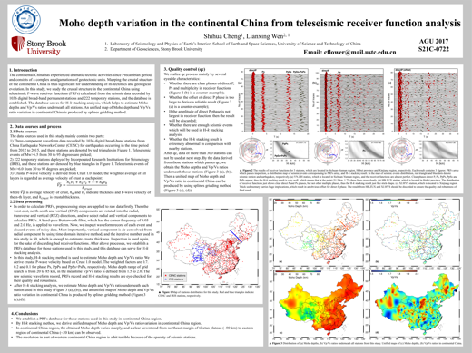
Moho depth variation in the continental China from teleseismic receiver
		 function analysis

ABSTRACT NUMBER: S21C−0722 (AGU 2017)

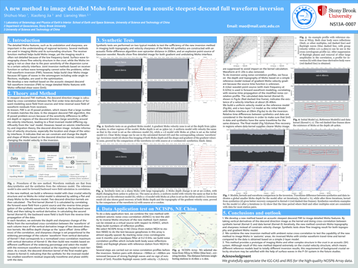
A new method to image detailed Moho feature based on acoustic steepest-descend
	  full waveform inversion

ABSTRACT NUMBER: NS13A−0007 (AGU 2017)

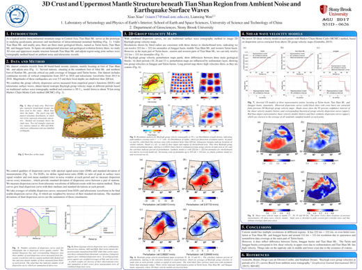
3D Crust and Uppermost Mantle Structure beneath Tian Shan Region from Ambient Noise and Earthquake Surface Waves

ABSTRACT NUMBER: S51D−0626 (AGU 2017)

Anisotropic Structure beneath the SE Margin of Tibet Plateau

ABSTRACT NUMBER: S43D−0883 (AGU 2017)

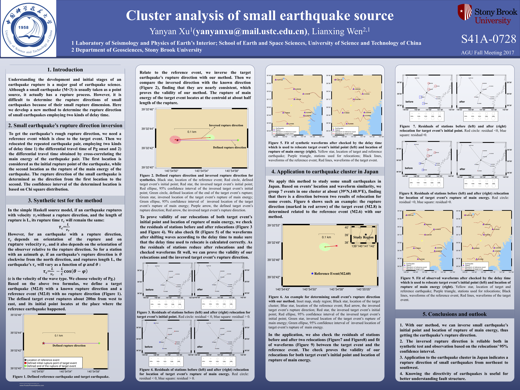
Cluster analysis of small earthquake source

ABSTRACT NUMBER: S41A−0728 (AGU 2017)

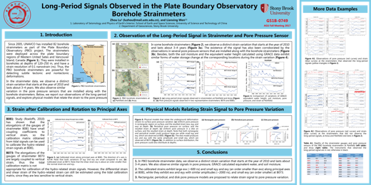
Long-Period Signals Observed in the Plate Boundary Observatory Borehole
		Strainmeters

ABSTRACT NUMBER: G51B-0749 (AGU 2017)

**附件:**

[田冬冬(2016)](DDTian-AGU2016.pdf), [田冬冬(2017-ICB)](DDTian-AGU2017-ICB.pdf),
[田冬冬(2017-NKNT)](DDTian-AGU2017-NKNT.pdf), [姚家园(2017-ICB)](JYYao-AGU2017-IC.png),
[姚家园(2017-NKNT)](JYYao-AGU2017-NKNT.png),\\
[唐兰兰(2017)](LLTang-AGU2017.pdf), [程世华(2017)](SHCheng-AGU2017.pdf),
[毛仕卓(2017)](SZMao-AGU2017.pdf), [肖晓(2017)](XXiao-AGU2017.pdf),
[刘彦吾(2017)](YWLiu-AGU2017.png),
[徐妍妍(2017)](YYXu-AGU2017.png), [陆洲(2017)](ZLu-AGU2017.pdf)
