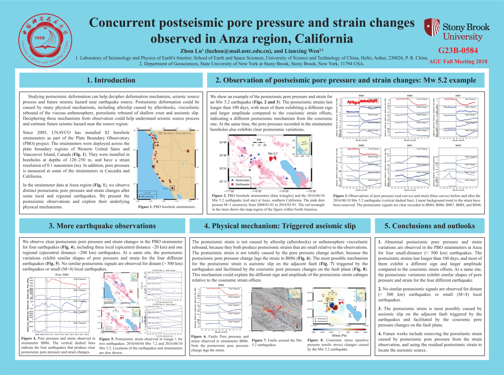
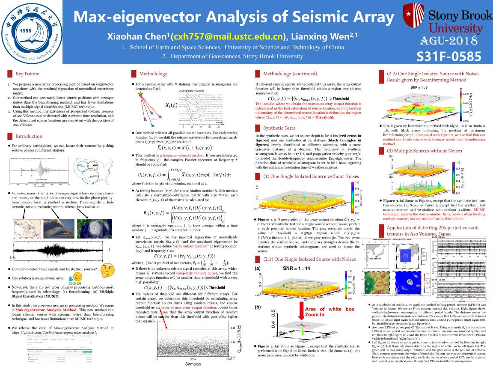
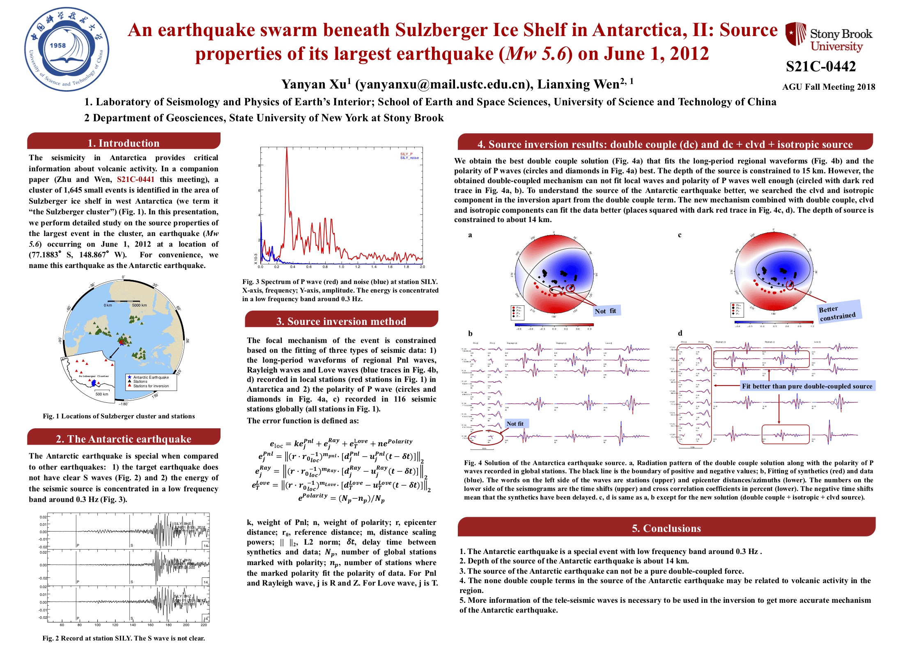
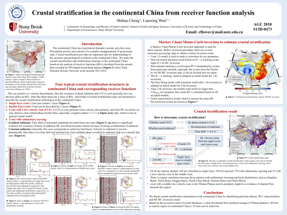
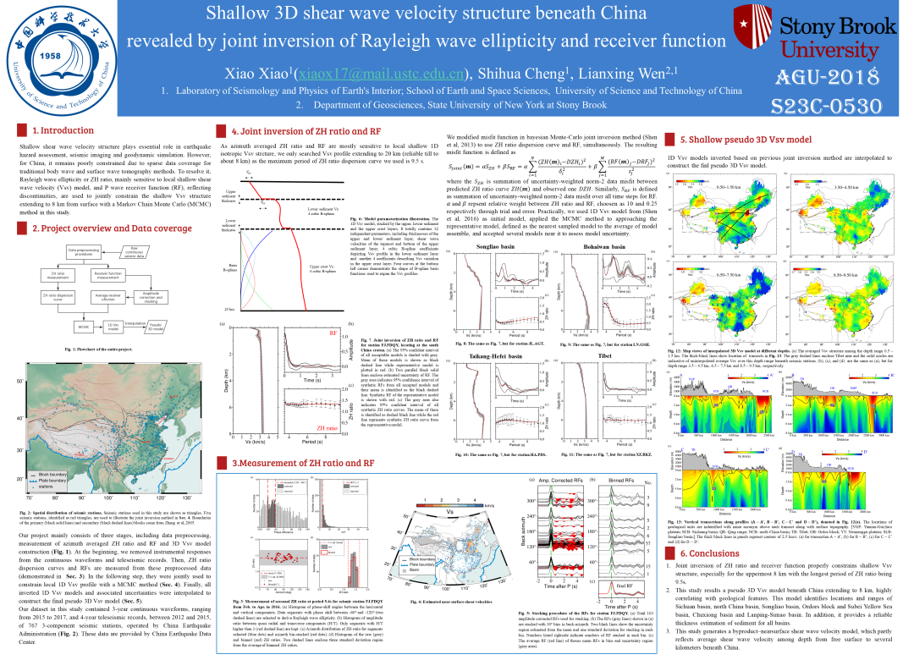
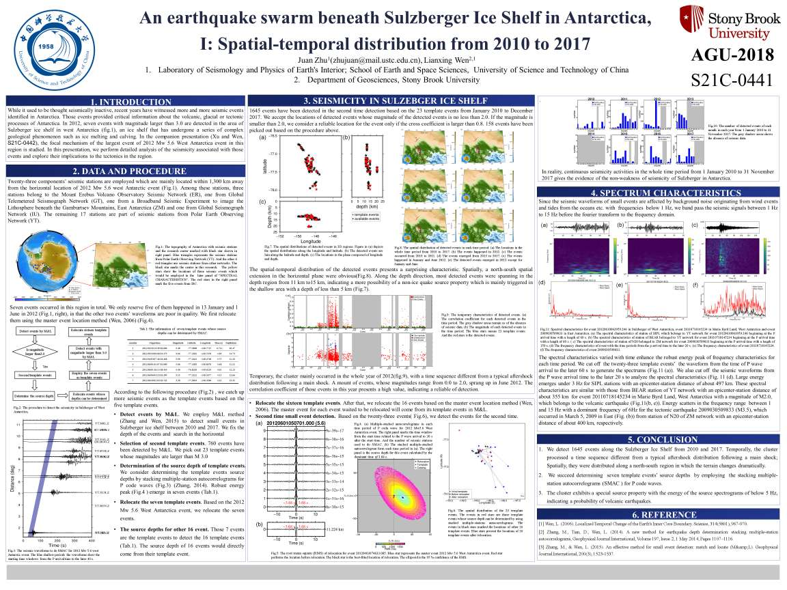
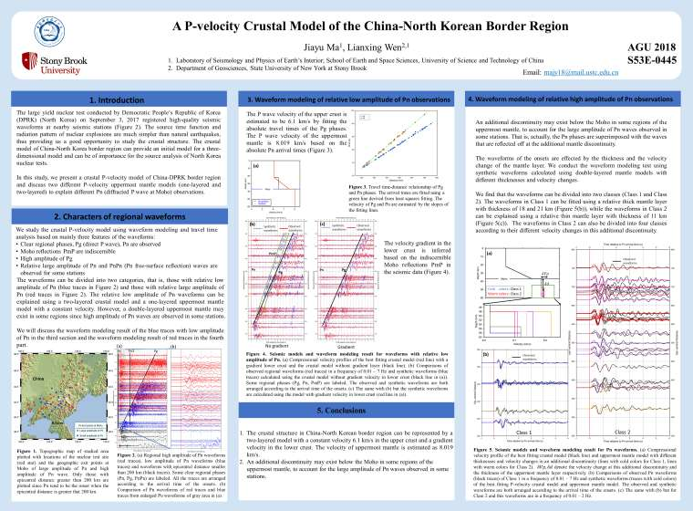

高分辨率海报请在附件下载！

题目: **Concurrent postseismic pore pressure and strain changes observed in Anza region, California**

作者: Zhou Lu, Lianxing Wen

摘要编号: G23B-0584

题目: **Max-eigenvector Analysis of Seismic Array**

作者: Xiaohan Chen, Lianxing Wen

摘要编号: S31F-0585 

题目: **An earthquake swarm beneath Sulzberger Ice Shelf in Antarctica, II: Source properties of its largest earthquake (Mw 5.6) on June 1, 2012**

作者: Yanyan Xu, Lianxing Wen

摘要编号: S21C-0442

题目: **Crustal stratification in the continental China from receiver function analysis**

作者: Shihua Cheng, Lianxing Wen

摘要编号: S13D-0473

题目: **Shallow 3D shear wave velocity structure beneath China revealed by joint inversion of Rayleigh wave ellipticity and receiver function**

作者: Xiao Xiao, Shihua Cheng, Lianxing Wen

摘要编号:  S23C-0530

题目: **An earthquake swarm beneath Sulzberger Ice Shelf in Antarctica, I: Spatial-temporal distribution from 2010 to 2017**

作者: Juan Zhu, Lianxing Wen

摘要编号:  S21C-0441

题目: **A P-velocity Crustal Model of the China-North Korean Border Region**

作者: Jiayu Ma, Lianxing Wen

摘要编号: S53E-0445

**附件：**

[陆洲(Zhou Lu)](ZLu.png) &nbsp;
[陈箫瀚(Xiaohan Chen)](XHChen.jpg) &nbsp;
[徐妍妍(Yanyan Xu)](YYXu.pdf) &nbsp;
[程世华(Shihua Cheng)](./SHCheng.png) &nbsp;
[肖晓(Xiao Xiao)](./XXiao.png) &nbsp; 
[诸娟(Juan Zhu)](./JZhu.pdf) &nbsp;
[马家宇(Jiayu Ma)](./JYMa.pdf) &nbsp;
 

