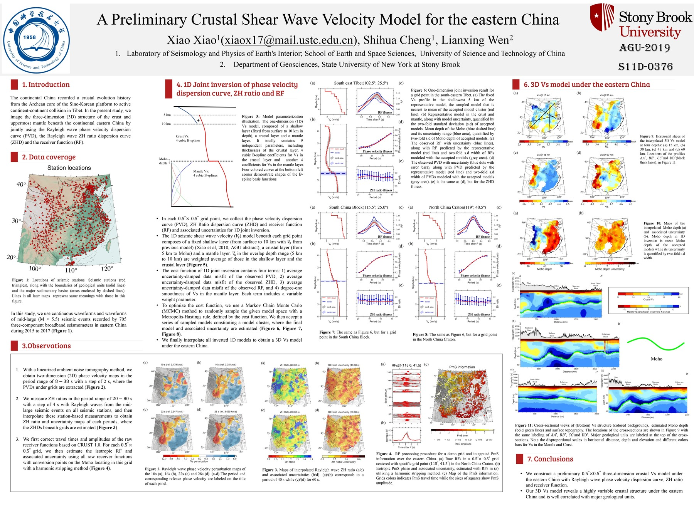
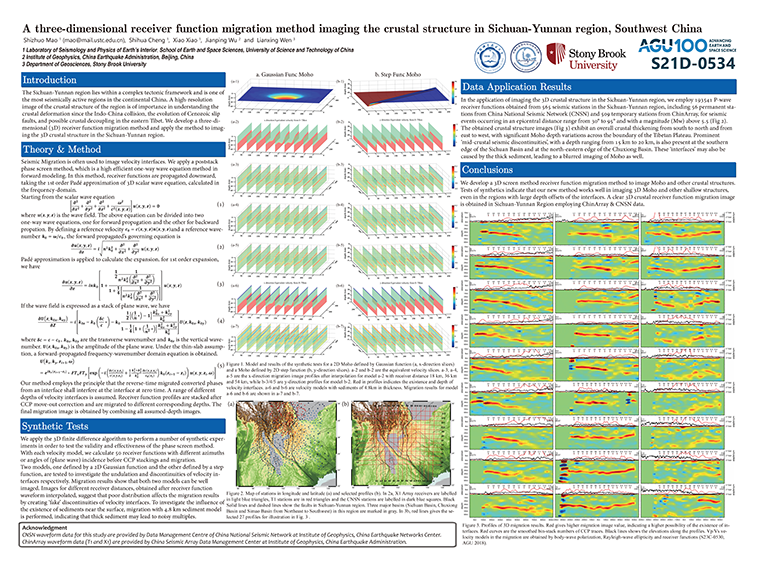
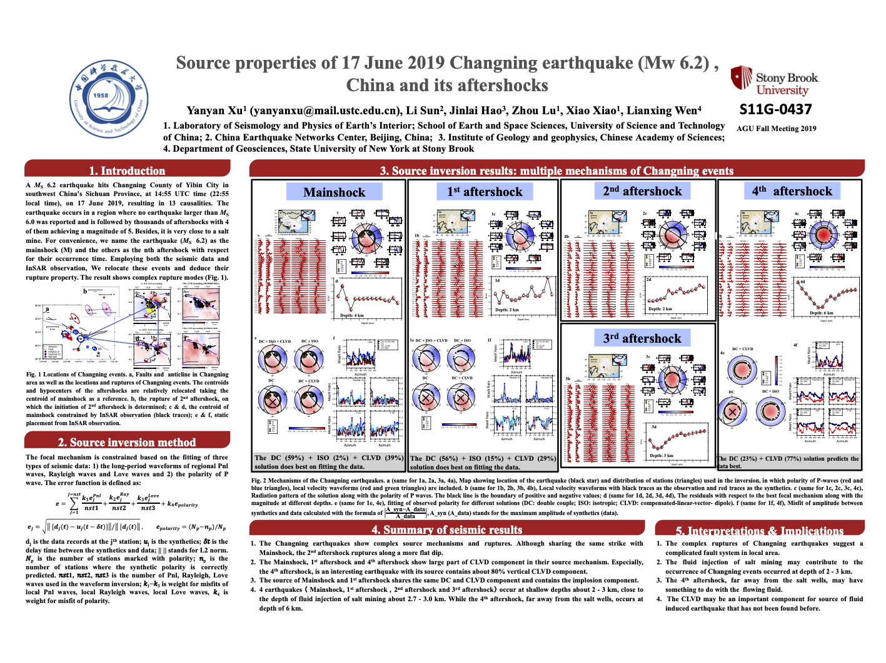
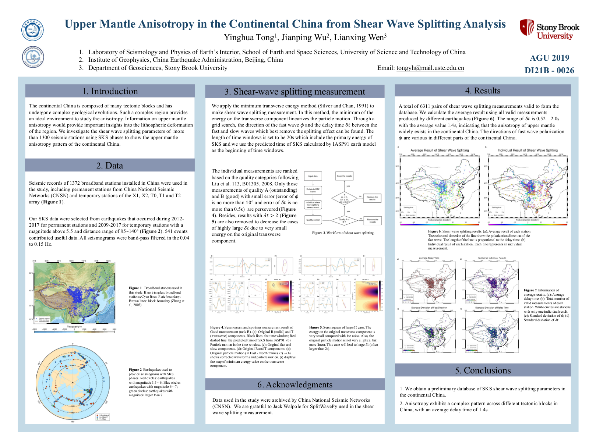
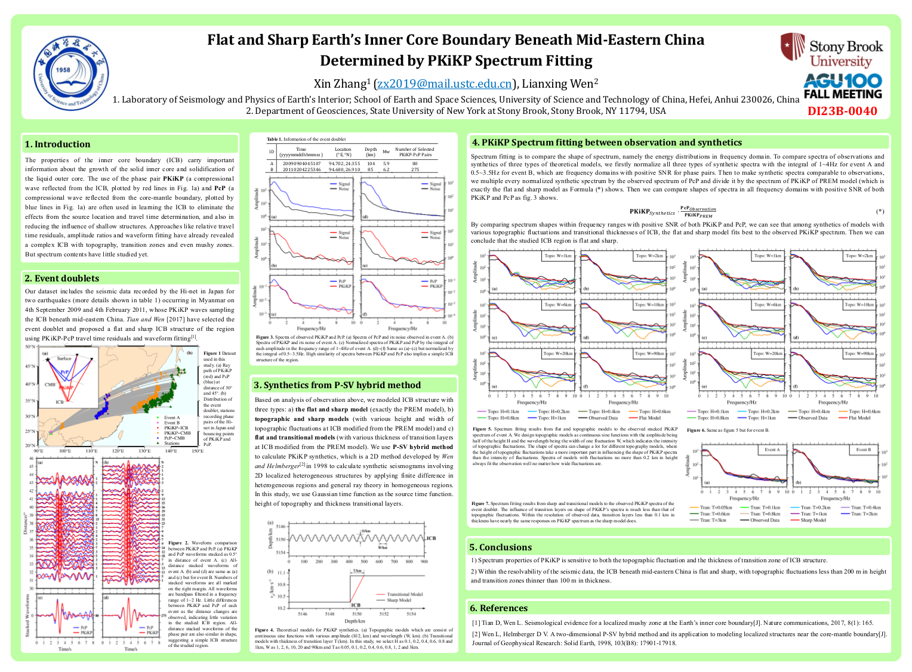

高分辨率海报请在附件下载！

题目: **A Preliminary Crustal Shear Wave Velocity Model for the continental China**

作者: Xiao Xiao, Shihua Cheng, Lianxing Wen

摘要编号:  S11D-0376

题目: **A three-dimensional receiver function migration method imaging the crustal structure in Sichuan-Yunnan Region, Southwest China**

作者: Shizhuo Mao, Shihua Cheng, Xiao Xiao, Jianping Wu, Lianxing Wen

摘要编号:  S21D-0534

题目: **Source properties of 17 June 2019 Changning earthquake (Mw 6.2) , China and its aftershocks**

作者: Yanyan Xu, Li Sun, Jinlai Hao, Zhou Lu, Xiao Xiao, Lianxing Wen

摘要编号:  S11G-0437

题目: **Upper Mantle Anisotropy in the Continental China from Shear Wave Splitting Analysis**

作者: Yinghua Tong, Lianxing Wen

摘要编号:  DI21B-0026

题目: **Flat and Sharp Earth’s Inner Core Boundary Beneath Mid-Eastern China Determined by PKiKP Spectrum Fitting**

作者: Xin Zhang, Lianxing Wen

摘要编号:  DI23B-0040

**附件：**

[肖晓(Xiao Xiao)](./XXiao.jpg) &nbsp; 
[毛仕卓(Shizhuo Mao)](./SZMao.pdf) &nbsp;
[徐妍妍(Yanyan Xu)](./YYXu.pdf) &nbsp;
[童滢桦(Yinghua Tong)](./YHTong.pdf) &nbsp; 
[张鑫(Xin Zhang)](./XZhang.pdf) &nbsp;
