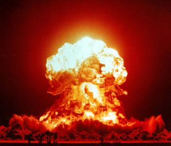

　　核试验监测不仅是科学问题，更是触及国家安全、民众关心，同时为核爆的威力、原料、技术等提供评估依据。自20世纪中期开始，美国和前苏联等国在发展核武器的同时，也很重视核爆监测，并在20世纪60年代建立了核爆监测系统，实现对核爆的时间、地点、威力、方式和核弹类型等参数评估。近年来，随着《全面禁止核试验条约》的提出，尽管核试验锐减，但核爆监测仍不容忽视。例如，距离中国吉林省边境仅70公里之遥的朝鲜，自2006年以来在咸镜北道吉州郡丰溪里核试验基地已经成功实施了三次地下核试验。

　　地下核试验的监测主要途径有：卫星图像、地震波和放射性元素。核试验之前，通过高分辨率的卫星，通过对核试验基地的坑道、运输系统等进行监测评估，但只能对其可能的核爆时间进行预测。核试验起爆数小时至数日后，通过坑道缓慢释放的放射性元素会被远处的监测站记录；通过分析这些放射性元素来源及成份，可以对核爆地点和原料进行判断。但是，这过程比较漫长（例如：2013年核试验之后，很长时间内并没有监测到放射性元素），另外受较多因素干扰（如：风向等），确定的位置也非常粗糙（只能判断位于某国家或区域）。最有效及时的办法是应用地震学手段来监测地下核爆。核爆激发的地震波立即向远处传播，通过分析地震仪记录的地震波到时定位，分析地震波的振幅对其当量进行估算。

　　如何根据地震波来确定核爆位置呢？我们通过一个非常简单例子来介绍。假设在空旷的区域有一个人在说话，在他的不同方向和距离处都有人在听，以每个听者为中心、声速乘以到时为半径画圆，这些圆的交点即确定为说话者的位置。在核爆定位中，声波被地球内部传播的地震波代替，核爆是那个说话的人，听者是众多的地震仪。传统的定位方法是根据参考速度模型分析地震波在各个台站的到时来确定核爆的位置。

　　如果说话的人和众多听者都位于茂密的森林或者高楼林立的城市，那么不仅声速会有变化（障碍物影响），还会有回音等干扰（波的反射、散射、衍射等），这就很难确定说话者的位置。同理，在传统核爆定位中，由于地下介质的复杂与不均匀性，会造成地震波速的变化以及反射波、散射波等的产生，而简单的地球参考模型远远描述不了实际复杂的地下速度，所以造成传统定位误差很大（数公里误差）。为了提高定位精度，温联星研究组提出了一种利用已知核爆产生的地震波做参考，消除地震波在地球内部传播的计算误差，使定位达到了前所未见的精度（几十米）。只要一个核试验基地进行过一次核爆试验，那么我们就可以精确定位此基地以后的每一次核爆。

　　2009年5月25日朝鲜第二次核试验后，温联星研究组以2006年核爆为参考（位置来源于卫星图像），确定出2009年核爆中心位于北纬41度17分38.14秒，东经129度4分54.21秒，定位精度为140米（[Wen and Long, SRL, 2010](https://dx.doi.org/10.1785/gssrl.81.1.26)）。而此前美国地质调查局水平方向定位误差为正负3.8 km。2013年2月12日朝鲜第三次试验后，我们以2009年位置为参考，确定出2013年核爆中心位于北纬41度17分26.88秒、东经129度4分34.68秒，定位误差为94米（[Zhang and Wen, GRL, 2013](https://dx.doi.org/10.1002/grl.50607)）。而美国地质调查局和国际禁核试组织公布的核爆中心位置的误差幅度为正负13.6公里和正负16.2公里。以2013年为例，下图所示为两次核试验的所用的台站及其记录到的波形。



　　在确定核爆当量方面，通常通过分析衰减矫正过的特定震相（如：Lg）振幅来计算震级，然后根据区域震级与当量间的经验关系，进而推算其当量。实际的核爆埋藏深度对其当量计算影响很大，但是极难确定，因此以往的当量研究大多是以最小埋藏深度的假设做前提。温联星研究组，在精定位工作基础上，应用卫星高程数据，推算核爆的实际埋藏深度，精确计算其在实际埋藏深度下的当量。我们分别确定2009年和2013年两次核爆的埋藏深度为610米和430米，通过计算Lg波的振幅推算出这两次核爆在此埋藏深度条件下的当量分布为7.0千吨和12.2千吨，误差分布为1.9千吨和3.8千吨（[Zhang and Wen, GRL, 2013](https://dx.doi.org/10.1002/grl.50607)）。以前研究中，各机构给出的当量差别很大。以2013年核爆为例，韩国国防部报告称此次核试验当量为6-7千吨，德国联邦地球科学与自然资源研究院（BGR）则估计其当量近40千吨。





关于朝鲜2009年核爆信息：

- [高精度定位文章](https://dx.doi.org/10.1785/gssrl.81.1.26) （Wen and Long， SRL, 2010）
- [美国地质调查局](http://comcat.cr.usgs.gov/earthquakes/eventpage/pde20090525005443120_0#summary)（USGS）
- [国际禁核组织](http://www.ctbto.org/the-treaty/developments-after-1996/2009-dprk-announced-nuclear-test/)（CTBTO）

关于朝鲜2013年核爆信息：

- [精确确定位置与当量的文章](https://dx.doi.org/10.1002/grl.50607)（Zhang and Wen，GRL, 2013）
- [美国地质调查局](http://comcat.cr.usgs.gov/earthquakes/eventpage/usc000f5t0#summary)（USGS）
- [国际禁核组织](http://www.ctbto.org/press-centre/press-releases/2013/on-the-ctbtos-detection-in-north-korea/)（CTBTO）
