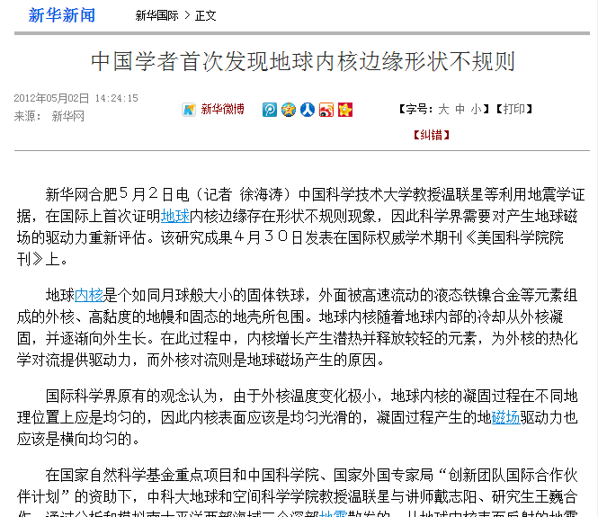
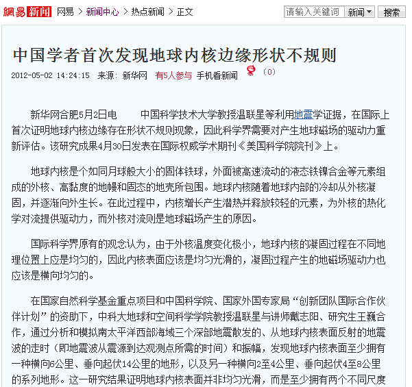
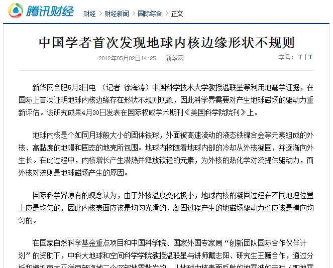
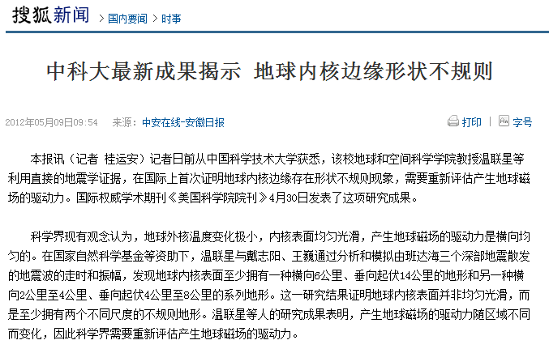
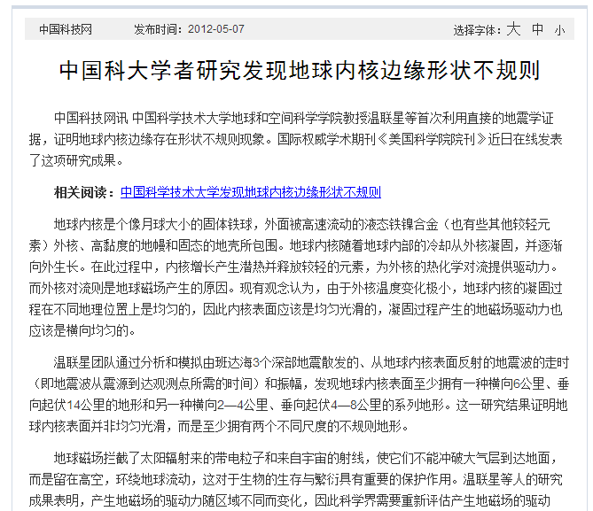

新华网 http://news.xinhuanet.com/world/2012-05/02/c_111872954.htm

---

网易新闻 http://news.163.com/12/0502/14/80GNUG4K00014JB5.html

---

腾讯新闻 http://finance.qq.com/a/20120502/005567.htm

---

搜狐新闻 http://news.sohu.com/20120509/n342736459.shtml

---

中国科技网http://www.edu.cn/cheng_guo_zhan_shi_1085/20120507/t20120507_773438.shtml
