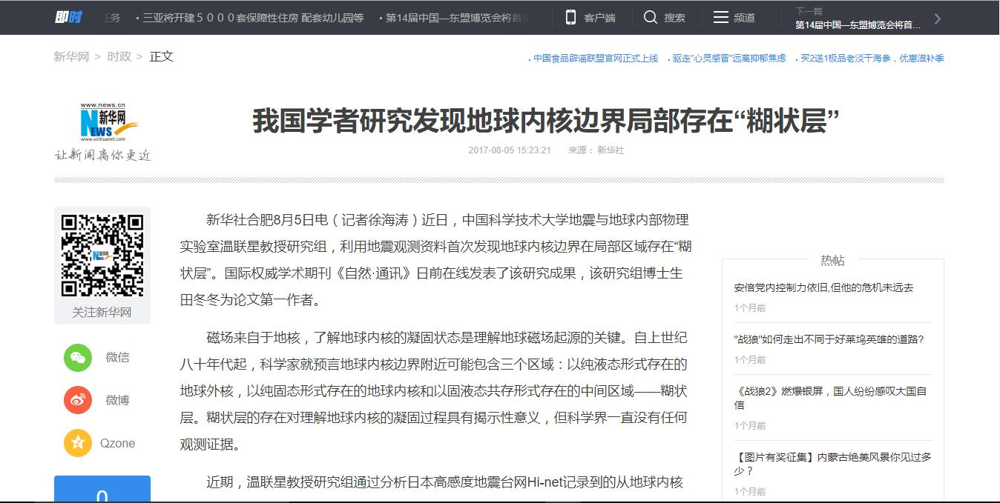

http://news.xinhuanet.com/politics/2017-08/05/c_1121436414.htm

---

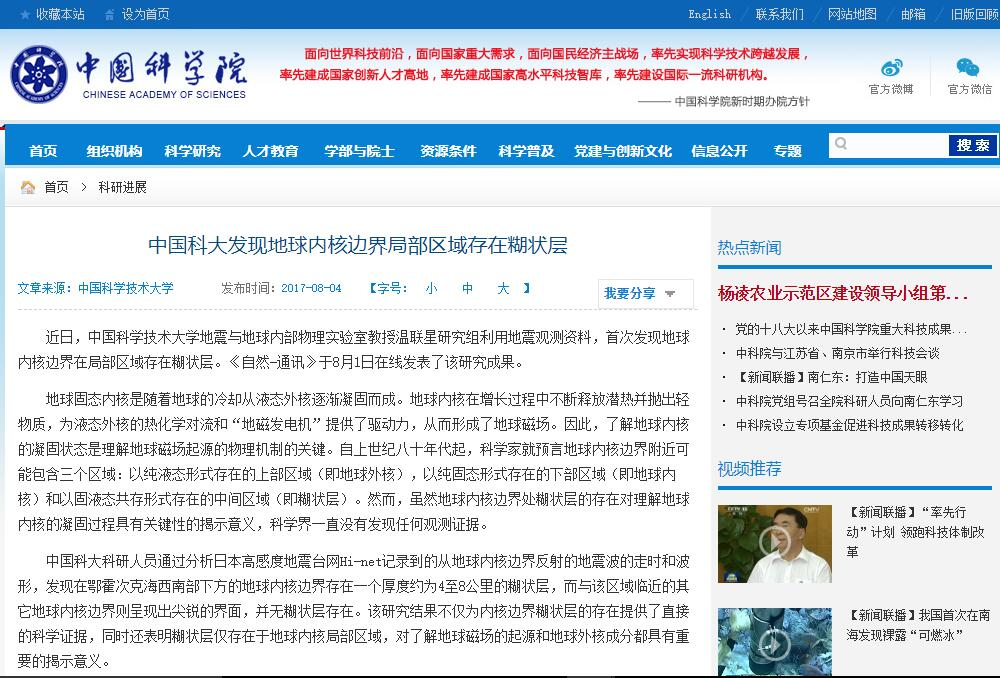

http://www.cas.cn/syky/201708/t20170804_4610561.shtml

---

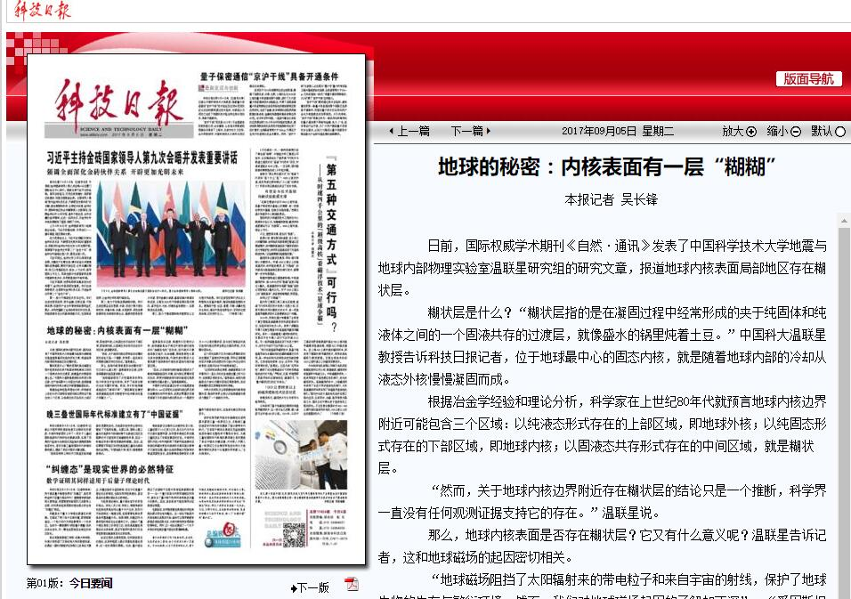

http://digitalpaper.stdaily.com/http_www.kjrb.com/kjrb/html/2017-09/05/content_377376.htm?div=-1

---

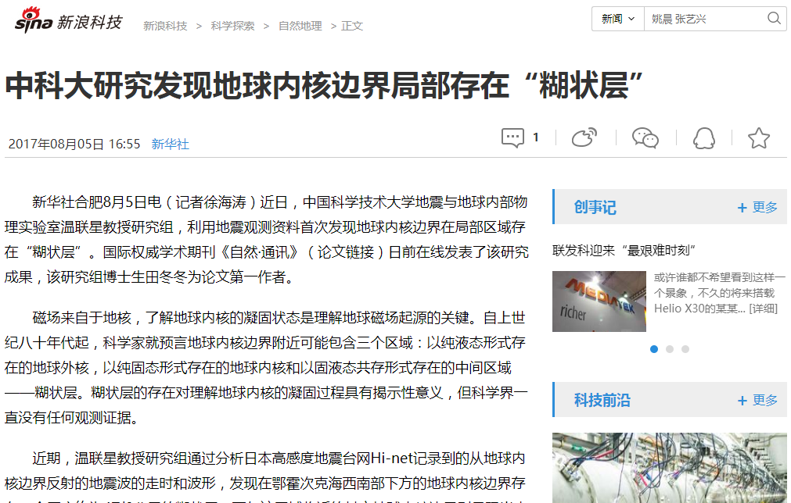

http://news.sina.com.cn/c/2017-08-06/doc-ifyitayr9350055.shtml

---

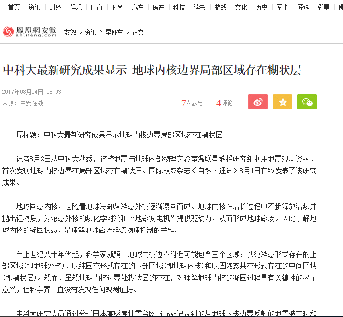

http://ah.ifeng.com/a/20170804/5881356_0.shtml

---

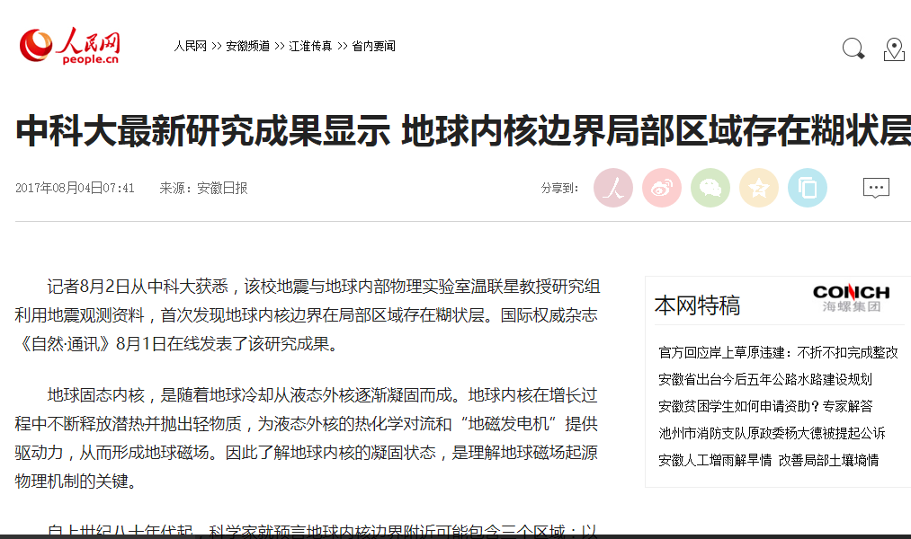

http://ah.people.com.cn/n2/2017/0804/c358428-30567967.html

---

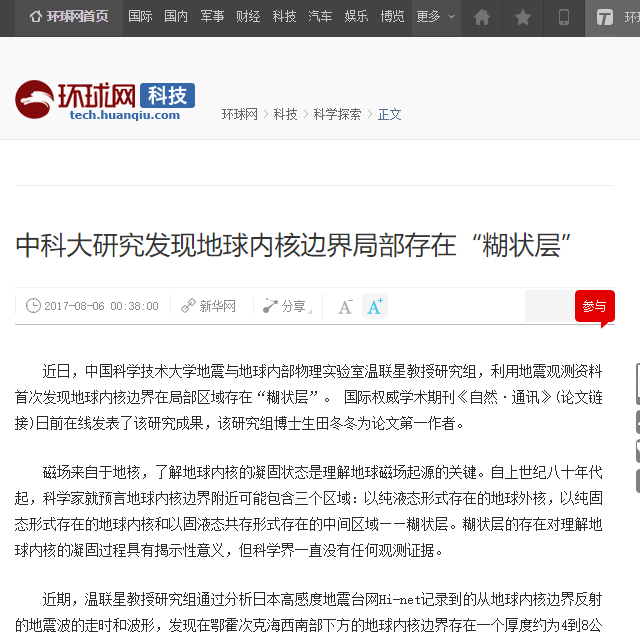

http://tech.huanqiu.com/discovery/2017-08/11085363.htm

---

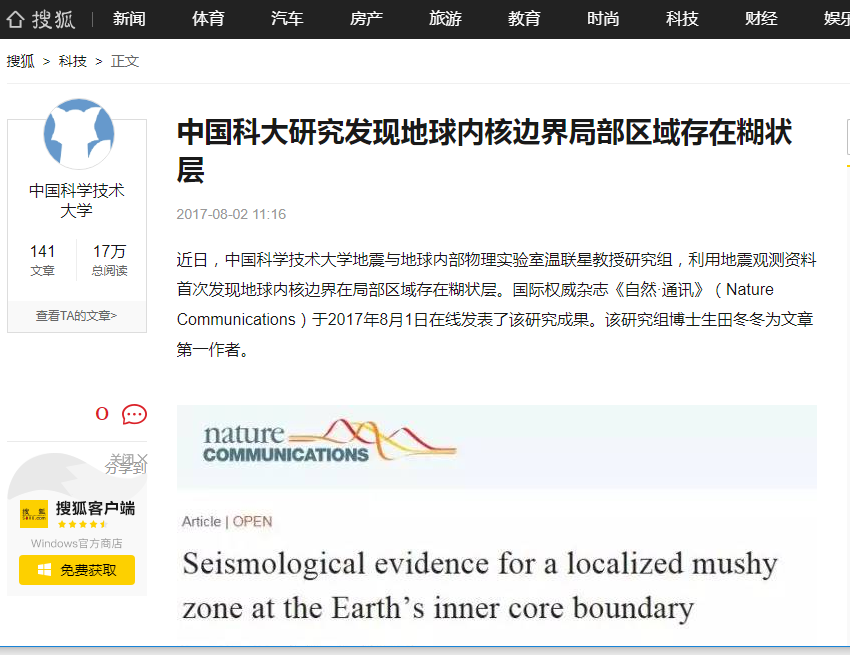

https://www.sohu.com/a/162446243_120809

---

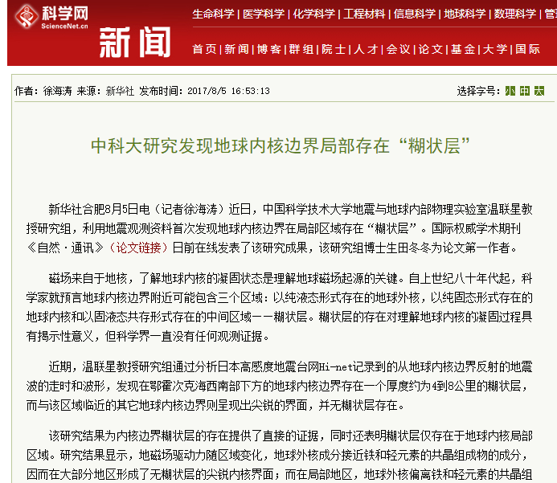

http://news.sciencenet.cn/htmlnews/2017/8/384363.shtm

---

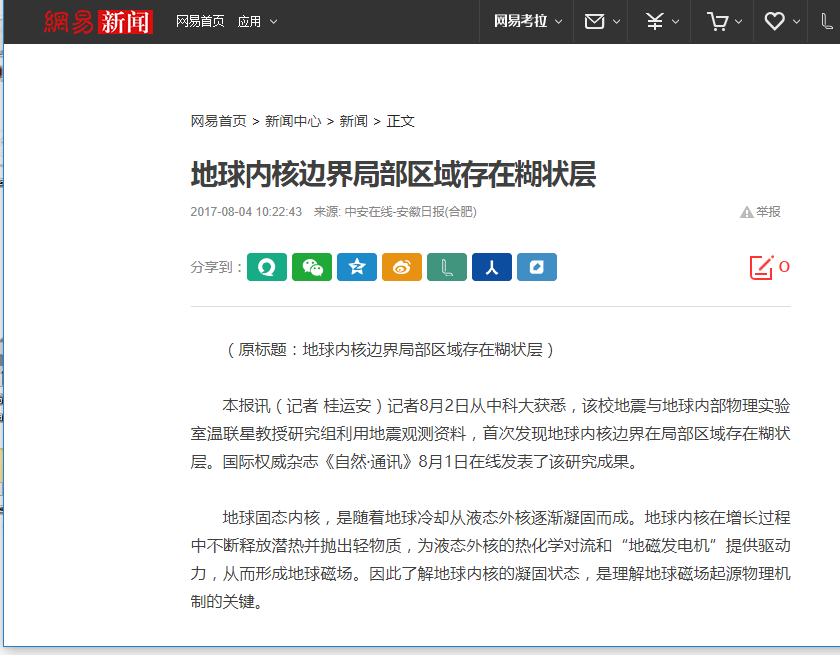

http://tech.163.com/17/0806/08/CR52L95N00097U81.html

---

http://news.xinhuanet.com/science/2017-09/06/c_136585604.htm

---

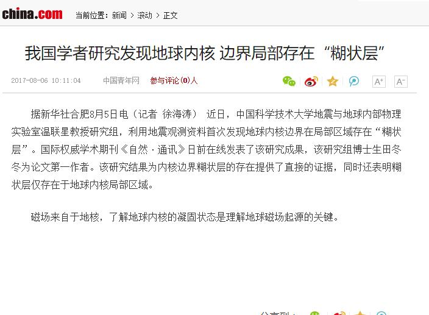

http://news.china.com/news100/11038989/20170806/31042994.html

---

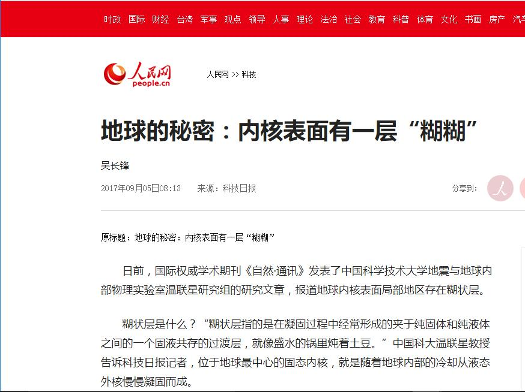

http://scitech.people.com.cn/n1/2017/0905/c1007-29515009.html

---

http://www.edu.cn/ke_yan_yu_fa_zhan/kexuetansuo/zui_xin_dong_tai/dili/201709/t20170905_1552072.shtml

---
