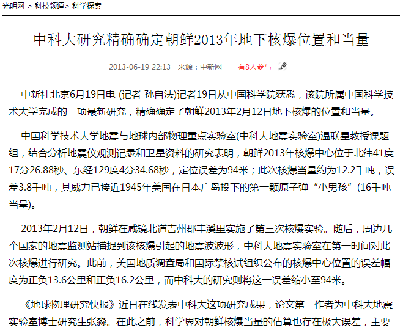

光明网http://tech.gmw.cn/2013-06/19/content_8014132.htm

---

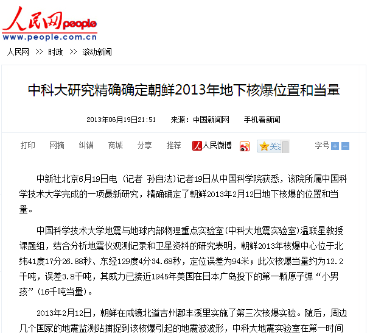

人民网 http://politics.people.com.cn/n/2013/0619/c70731-21901618.html

---

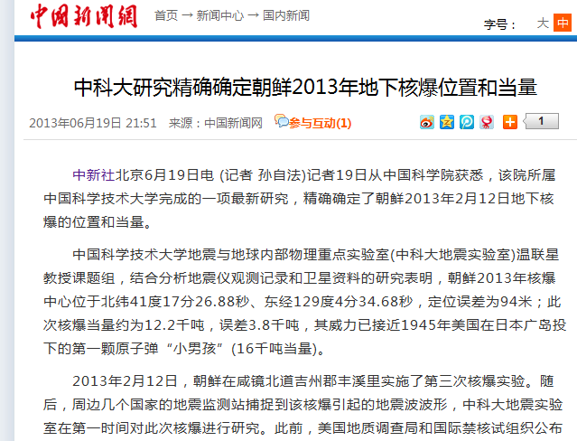

中新网http://www.chinanews.com/gn/2013/06-19/4947418.shtml

---

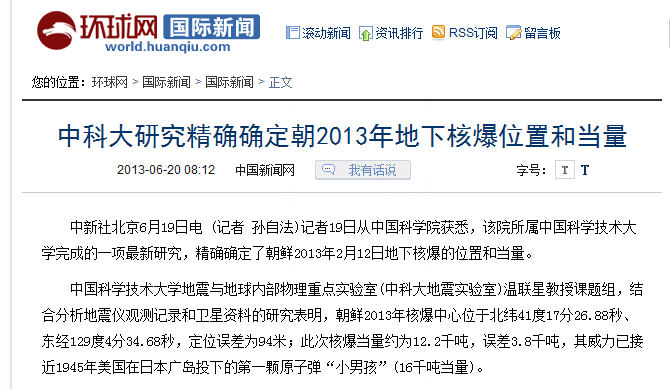

环球网http://mil.huanqiu.com/china/2013-06/4045134.html

---

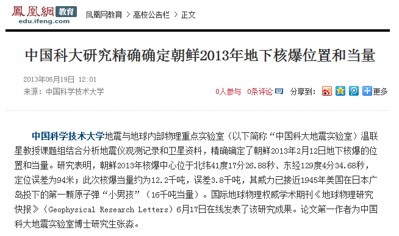

凤凰网http://news.ifeng.com/world/special/chaoxiansanheshi/content-3/detail_2013_06/19/26580613_0.shtml?_from_ralated

---

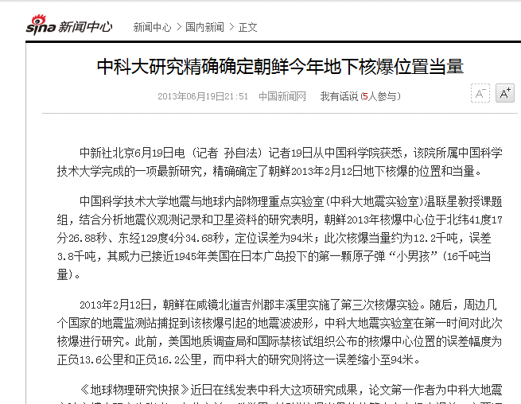

新浪http://news.sina.com.cn/c/2013-06-19/215127444682.shtml

---

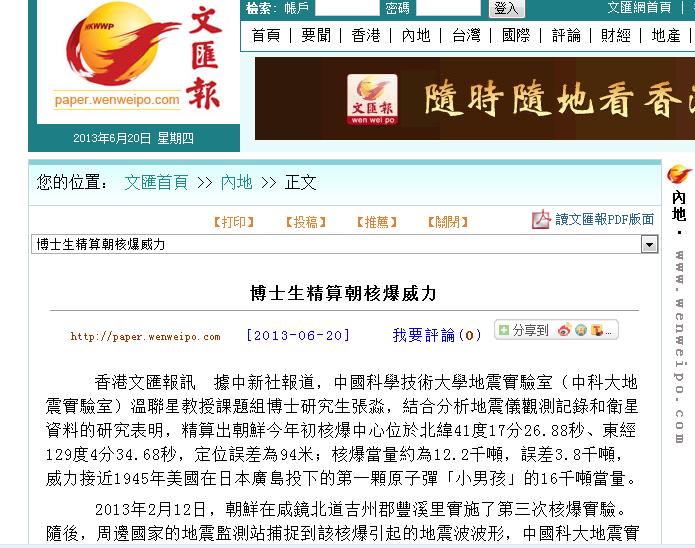

文汇报http://news.wenweipo.com/2013/06/20/IN1306200065.htm

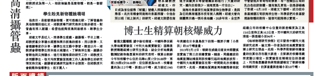

---

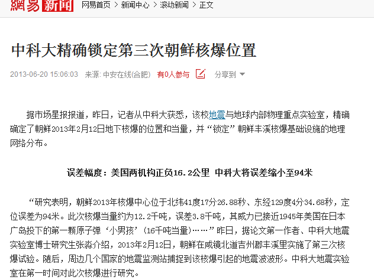

网易新闻http://news.163.com/13/0620/15/91QQRED300014AED.html

---

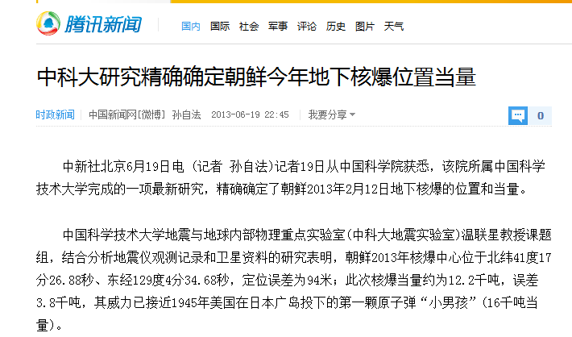

---

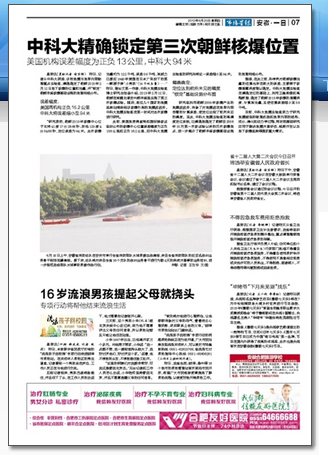
