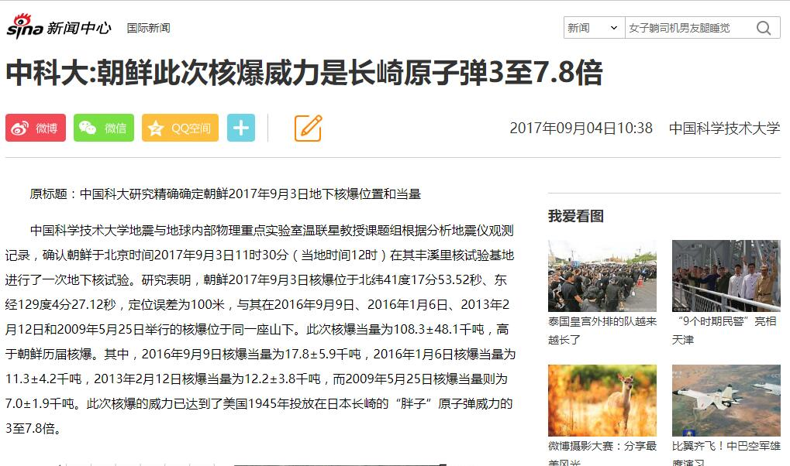
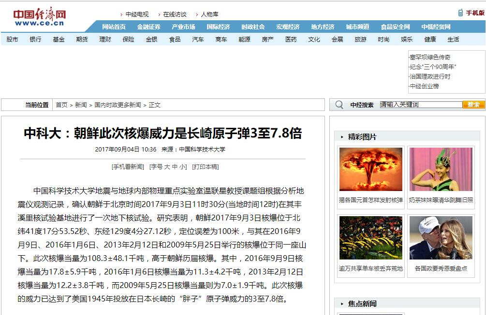
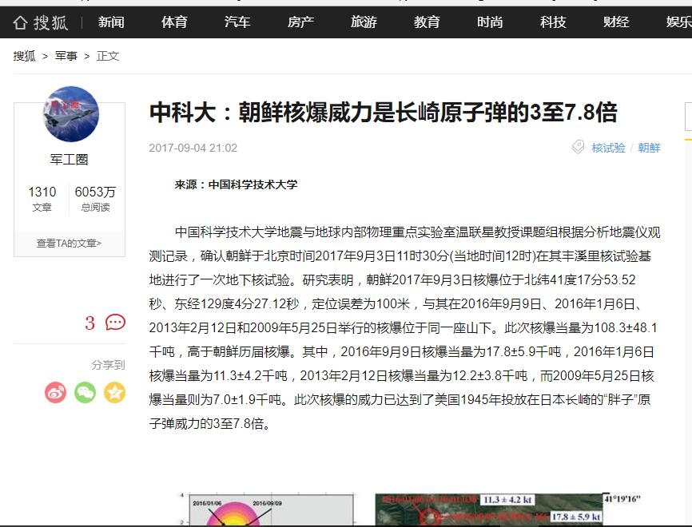
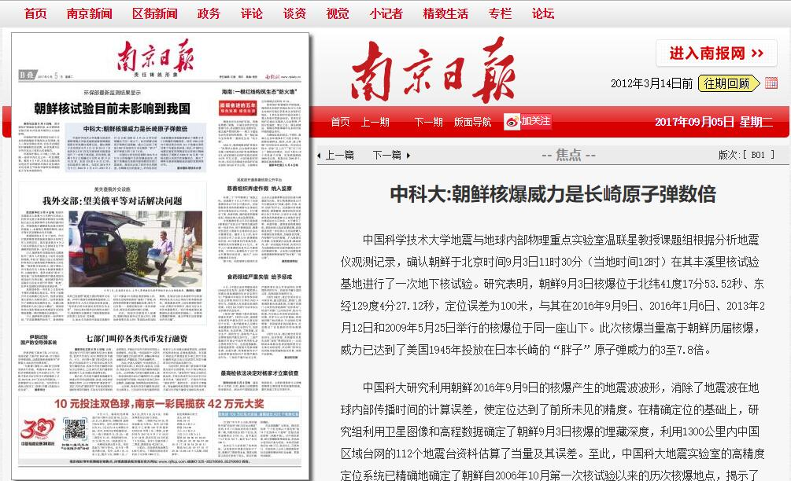
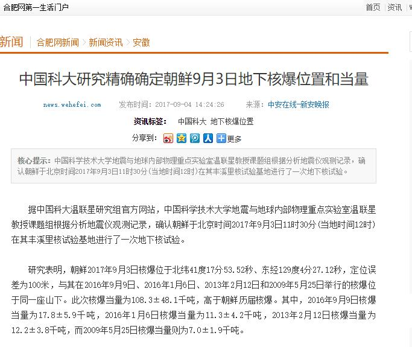
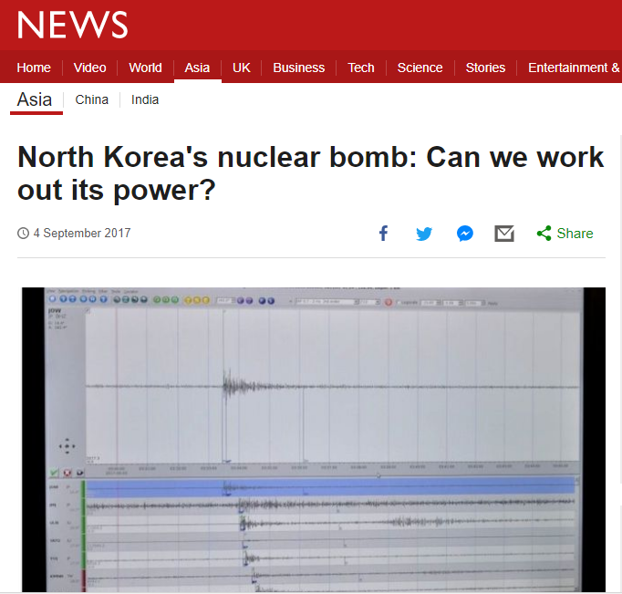
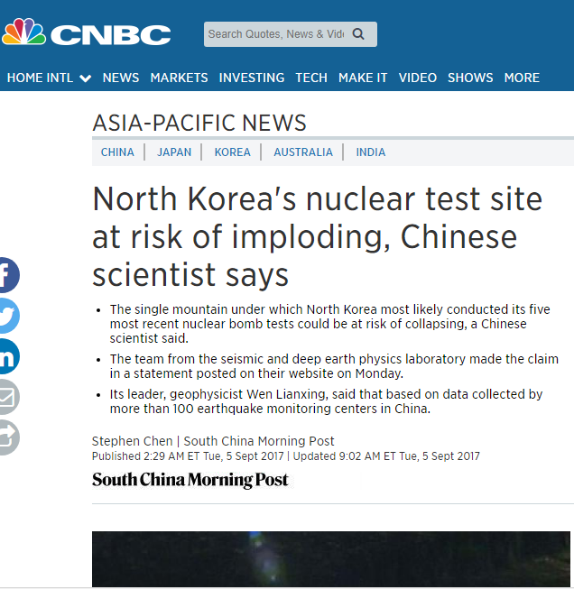

http://news.sina.com.cn/w/sy/2017-09-04/doc-ifykpysa3053683.shtml

---

http://www.ce.cn/xwzx/gnsz/gdxw/201709/04/t20170904_25713510.shtml

---

http://www.sohu.com/a/169500504_162220

---

http://njrb.njdaily.cn/njrb/html/2017-09/05/content_471944.htm?div=-1

---

http://news.wehefei.com/system/2017/09/04/011099026.shtml

http://www.bbc.com/news/world-asia-41144326

https://www.cnbc.com/2017/09/05/north-koreas-nuclear-test-site-at-risk-of-imploding-chinese-scientist-says.html
