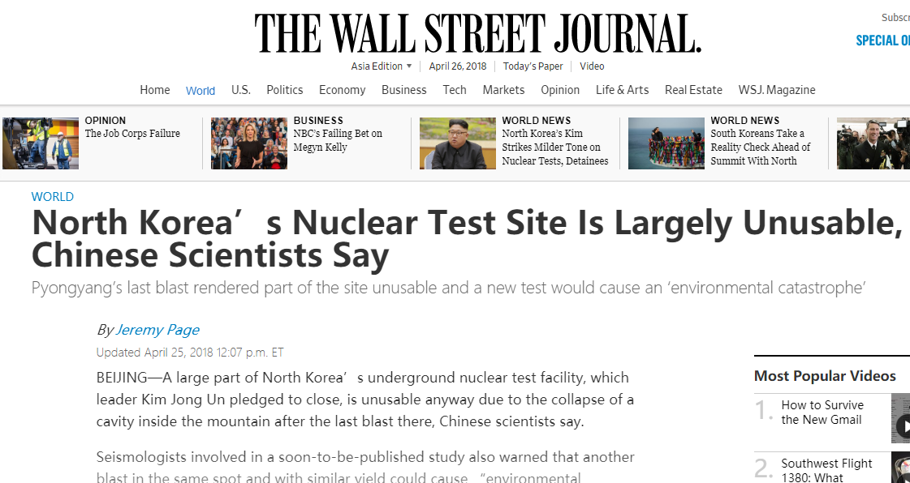
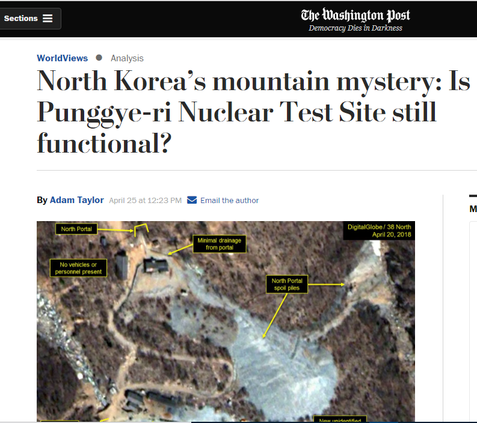
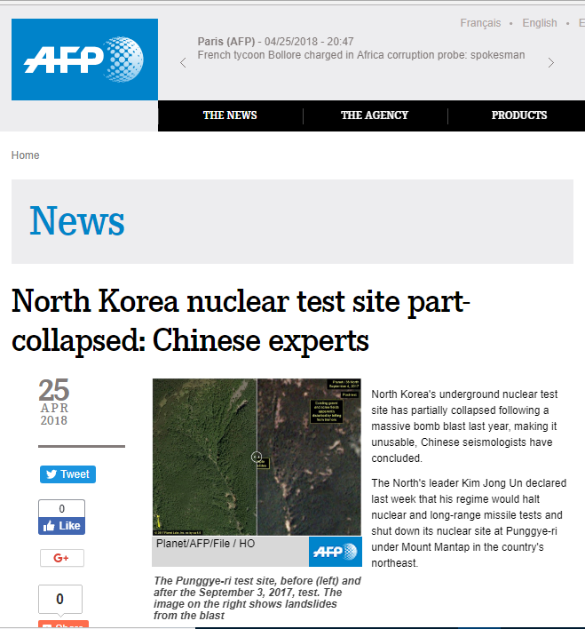
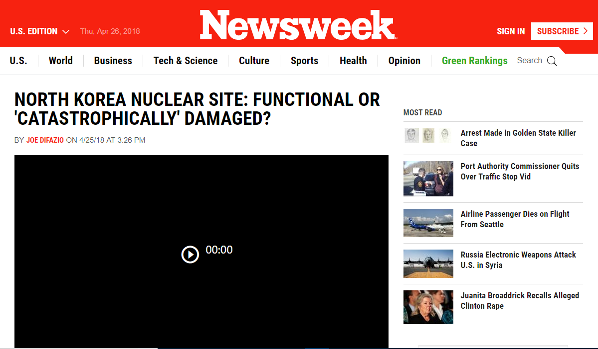
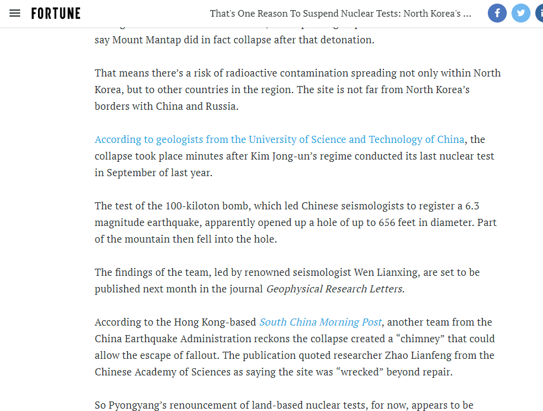
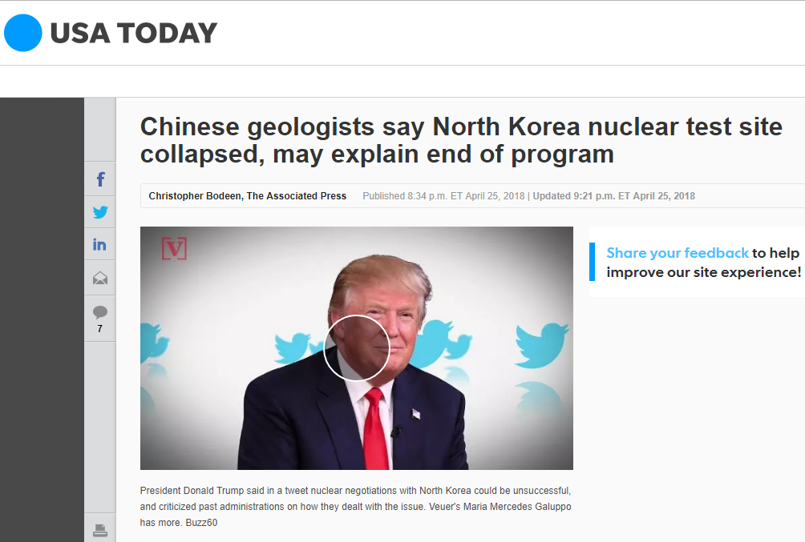
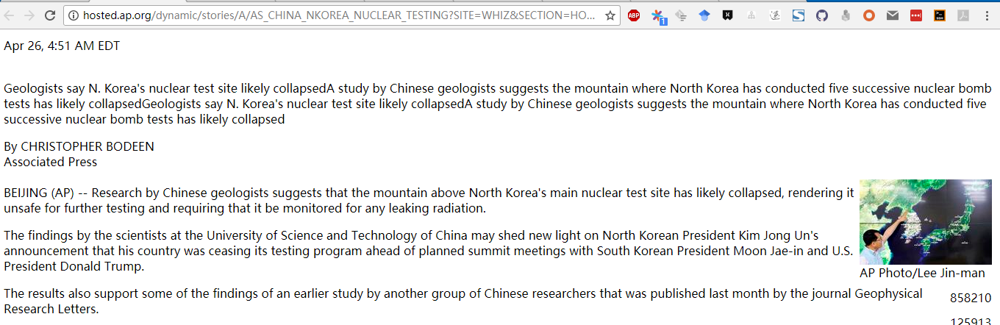
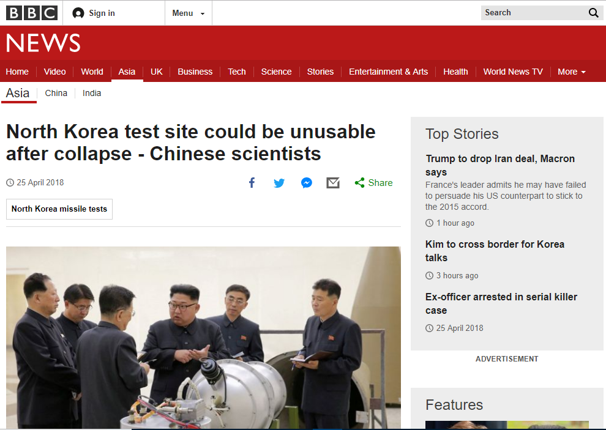
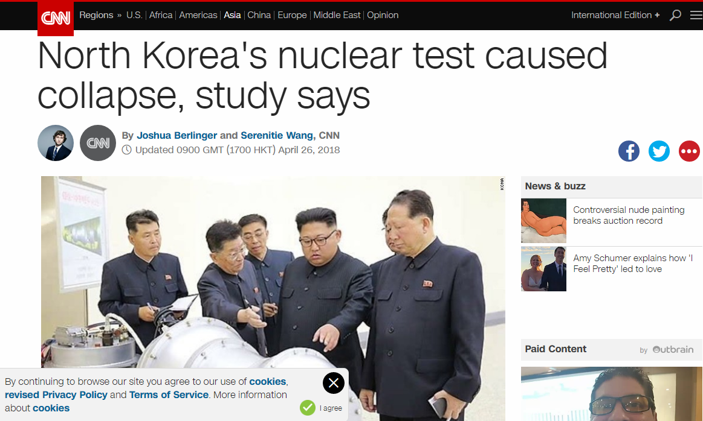

https://www.wsj.com/articles/north-koreas-underground-nuclear-test-facility-is-damaged-experts-say-1524643948

https://www.inkstonenews.com/science/north-koreas-nuclear-test-site-wrecked-chinas-scientists-found/article/2143305

https://www.washingtonpost.com/news/worldviews/wp/2018/04/25/north-koreas-mountain-mystery-is-punggye-ri-nuclear-test-site-still-functional/?noredirect=on&utm_term=.3f78c8965e53

https://www.afp.com/en/news/826/north-korea-nuclear-test-site-part-collapsed-chinese-experts-doc-14b1qr1

http://www.newsweek.com/north-korea-donald-trump-kim-jong-un-nuclear-weapon-nuclear-test-901315

http://fortune.com/2018/04/25/north-korea-nuclear-test-mountain-mount-mantap/

https://www.usatoday.com/story/money/2018/04/25/north-koreas-nuclear-test-site-collapsed/552421002/

http://hosted.ap.org/dynamic/stories/A/AS_CHINA_NKOREA_NUCLEAR_TESTING?SITE=WHIZ&SECTION=HOME&TEMPLATE=DEFAULT

http://time.com/5255265/north-korea-nuclear-test-site-collapse/

http://www.bbc.com/news/world-asia-43894394

https://www.cnn.com/2018/04/26/asia/north-korea-nuclear-test-site-punggye-ri-intl/index.html
