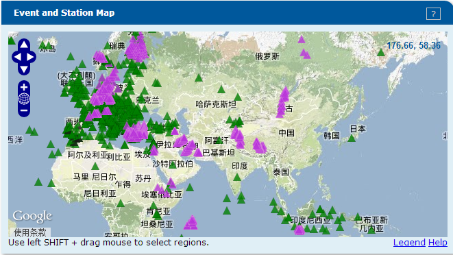

GFZ是德语GeoForschungsZentrum（地球科学研究中心）的简称。该机构提供GEOFON以及其他地震台网的公开数据下载。从1980到2014年间可下载公开数据的台站（包括临时与永久台站）约1600个，分布于全球，主要集中在欧洲。

GFZ的数据请求总介绍页面：http://geofon.gfz-potsdam.de/waveform/

较为推荐3种数据请求方式：

1. 在线工具：http://eida.gfz-potsdam.de/webdc3/
2. 与IRIS相同的BREQ_FAST邮件请求：http://geofon.gfz-potsdam.de/waveform/breq_fast.php
3. 命令行工具arclink_fetch：http://www.seiscomp3.org/wiki/doc/applications/arclink_fetch
